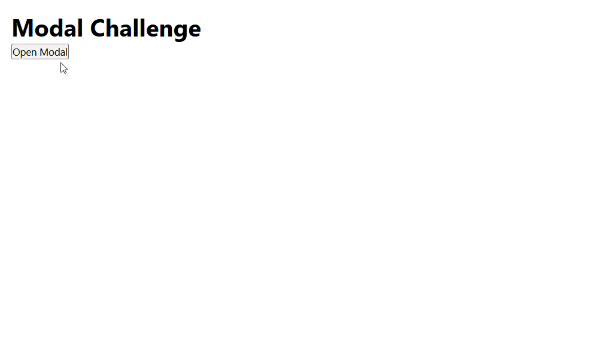

# Challenge #4: The Modal component (Dialog)

I implemented a **Portal-based architecture**. By using `createPortal`, I ensured the modal remains on top and independent of parent CSS constraints like `overflow: hidden` or `z-index`.

For the behavior, I used a `useEffect` hook to synchronize the modal state with the browser environment:
1. **Scroll Lock:** Dynamically toggling `overflow: hidden` on the body.
2. **Keyboard Support:** Adding a global listener for the `Escape` key.
3. **Propagation Control:** Using `e.stopPropagation()` on the modal container to isolate it from the overlay's click handler.

